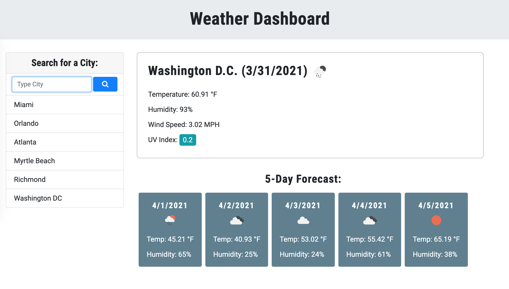
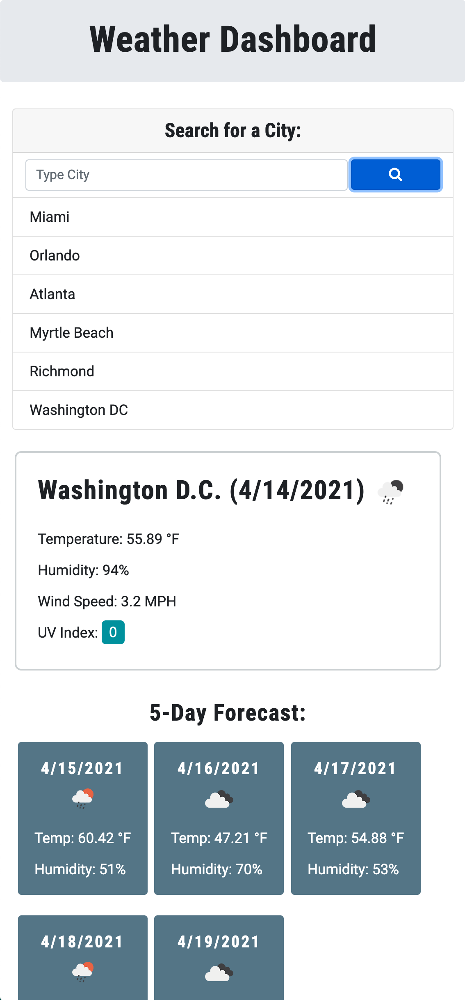

# weather-dashboard

This is a weather dashboard that runs in the browser and features dynamically updated HTML and CSS. It uses [OpenWeather API](https://openweathermap.org/api) to retrieve weather data for cities.

Here is the link to the deployed application: [Weather Dashboard] (https://icvalle.github.io/weather-dashboard/)

The following image shows the web application’s appearance.

